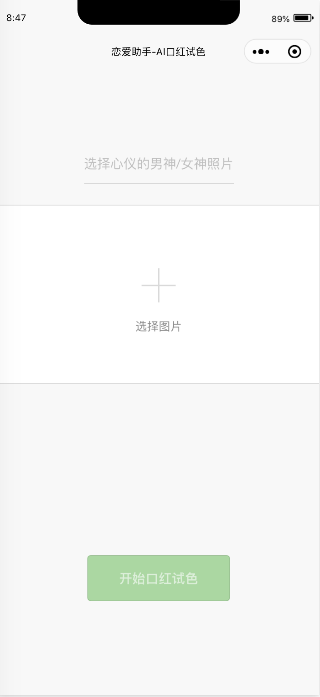
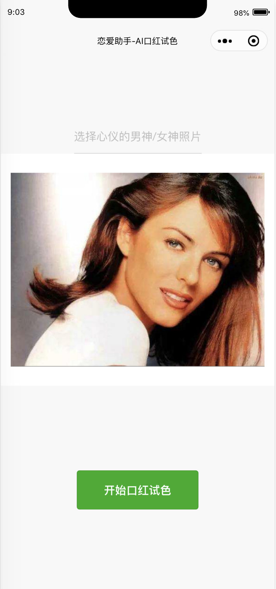
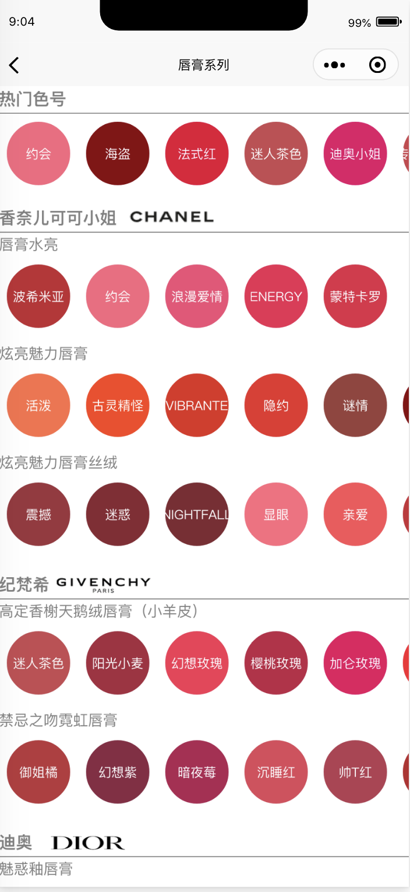
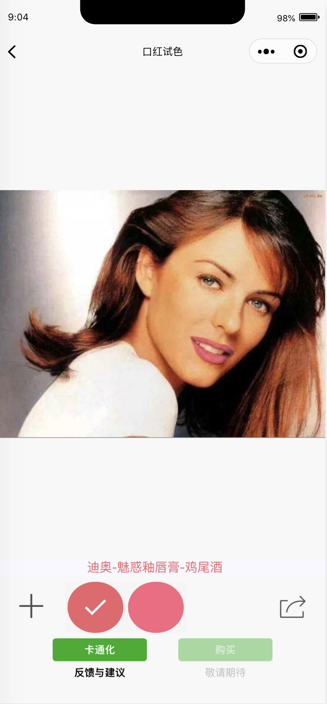
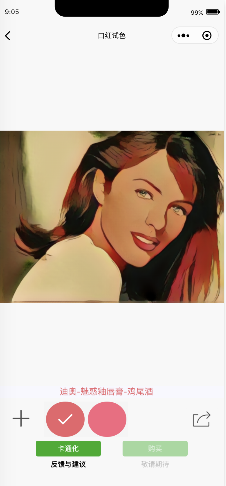

# ai-lipstick-color

AI口红试色，微信小程序。

## 功能

1. 拍照或者从手机中选取图片上传

2. 对图片进行审核
3. 选择口红试色，替换图片中人物的嘴唇颜色

4. 图片卡通化（额外功能）

## 注意事项

1. 这里仅包括微信小程序代码，请求后端接口必须使用https，这是微信小程序平台强制要求的
2. 开源部分使用的appid是测试id，需要替换为正式id才能使用云函数相关功能
3. 云函数相关功能是用来图片审核，微信小程序平台强制要求上传的图片必须做审核
4. 跳转购买链接相关功能没有做的原因是微信不允许跳外链，各方面其他限制比较多
5. AI相关功能的后端代码，将在未来某个时刻尽快公布，敬请期待。

## 示例

线上环境已经发布这个应用，可以在微信搜索栏搜索"AI口红试色"，体验一下。
